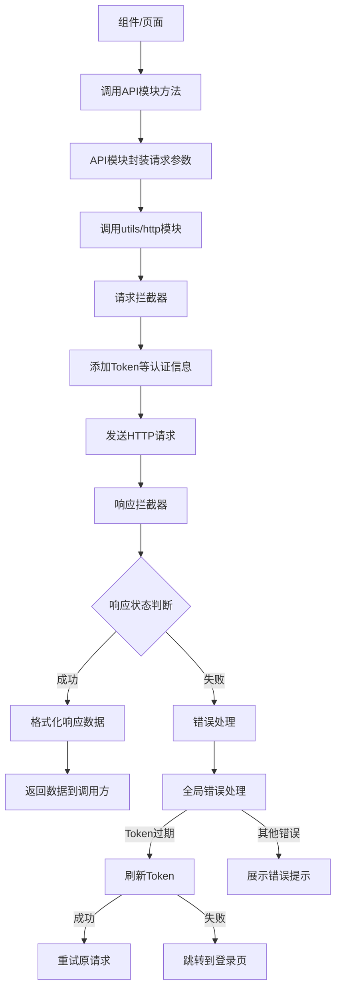
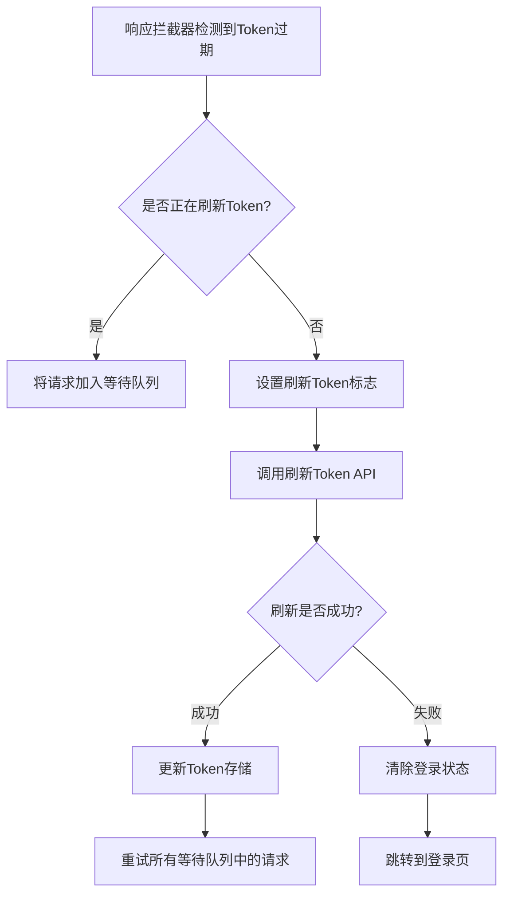
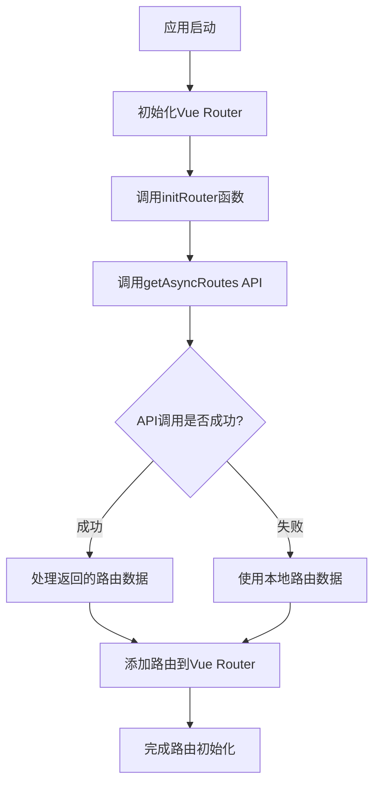
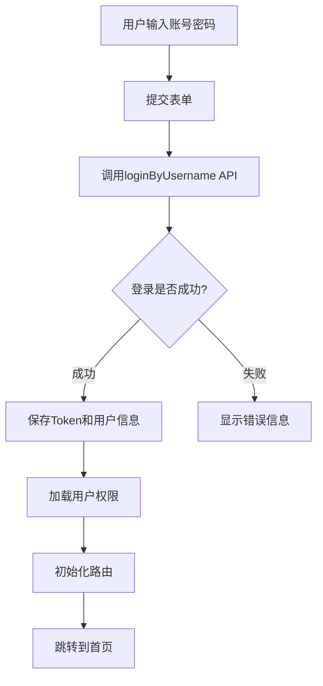
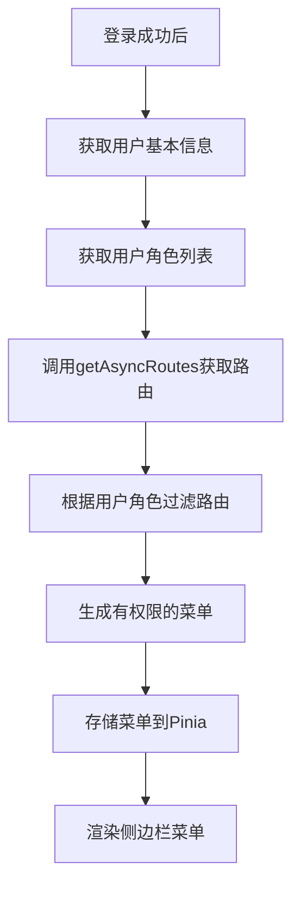
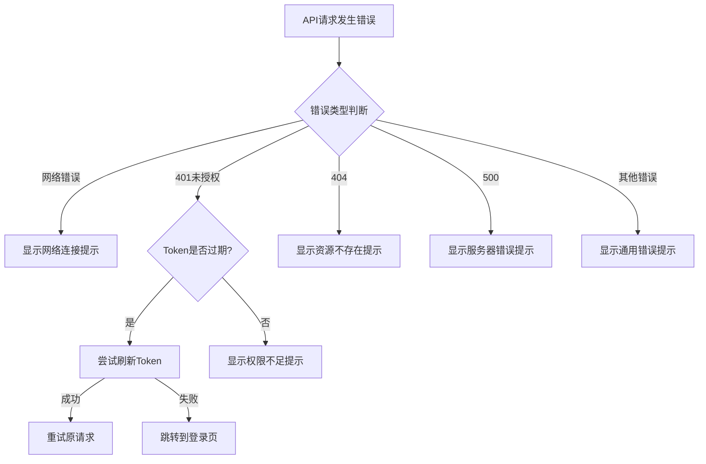
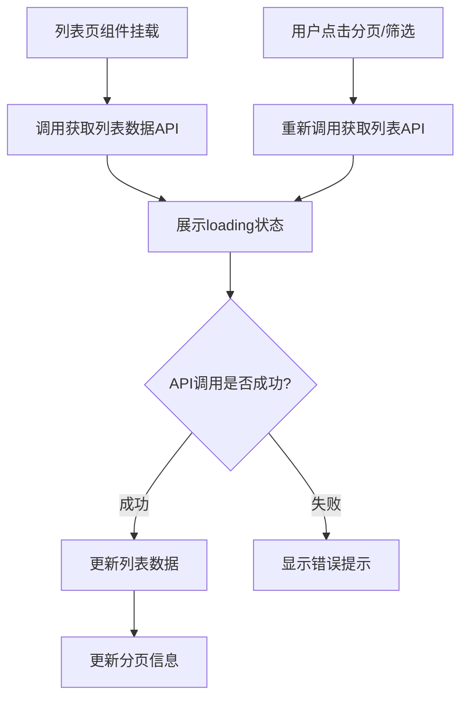
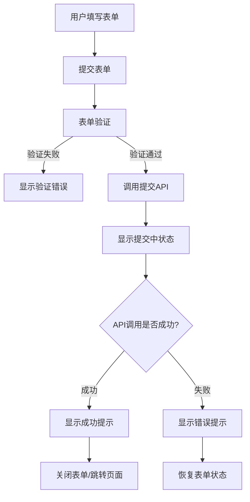
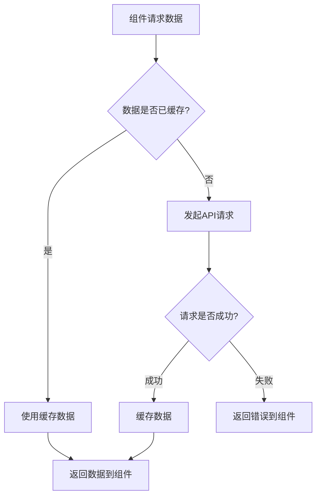
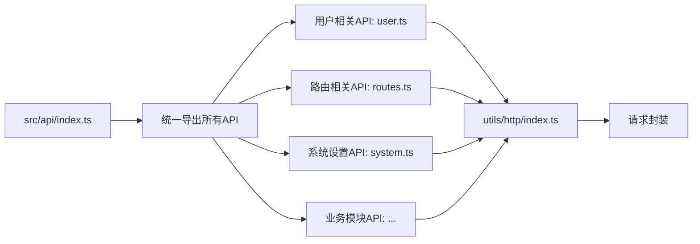

# Vue Pure Admin API调用流程图

本文档提供了Vue Pure Admin项目中API调用的详细流程图，帮助开发者理解项目的数据流转和请求处理机制。

## API调用系统整体架构

```
+---------------------------------------------------------------+
|                        业务组件/页面                            |
+---------------------------------------------------------------+
                |                  ^
                | 调用API          | 返回数据/错误
                v                  |
+---------------------------------------------------------------+
|                      API模块 (src/api/*.ts)                    |
|                                                               |
|   +---------------------+   +-----------------------------+   |
|   | 用户API (user.ts)    |   | 路由API (routes.ts)         |   |
|   +---------------------+   +-----------------------------+   |
|   | 系统API (system.ts)  |   | 业务模块API (module/*.ts)   |   |
|   +---------------------+   +-----------------------------+   |
+---------------------------------------------------------------+
                |                  ^
                | 封装请求         | 处理响应
                v                  |
+---------------------------------------------------------------+
|                   HTTP工具模块 (utils/http)                    |
|                                                               |
|   +---------------------+   +-----------------------------+   |
|   | 请求拦截器           |   | 响应拦截器                  |   |
|   | - 添加Token         |   | - 统一错误处理               |   |
|   | - 处理请求格式       |   | - Token刷新                 |   |
|   +---------------------+   +-----------------------------+   |
|                                                               |
|   +---------------------+   +-----------------------------+   |
|   | 请求重试机制         |   | 响应数据转换                |   |
|   +---------------------+   +-----------------------------+   |
+---------------------------------------------------------------+
                |                  ^
                | HTTP请求         | HTTP响应
                v                  |
+---------------------------------------------------------------+
|                       后端API / Mock数据                       |
+---------------------------------------------------------------+
```

## 基本API调用流程



## Token刷新流程



## 路由加载与API调用关系



## 登录流程与API调用



## 权限加载流程



## 请求错误处理流程



## 组件与API的典型交互模式

### 列表页模式



### 表单提交模式



## API缓存策略



## API模块组织结构



此流程图文档旨在帮助开发者理解Vue Pure Admin项目中API调用的全流程，从组件发起请求到处理响应的完整路径，以及各种特殊情况下的处理逻辑。开发者可以参考这些流程图来理解系统的数据流，并在此基础上进行功能扩展或问题排查。 