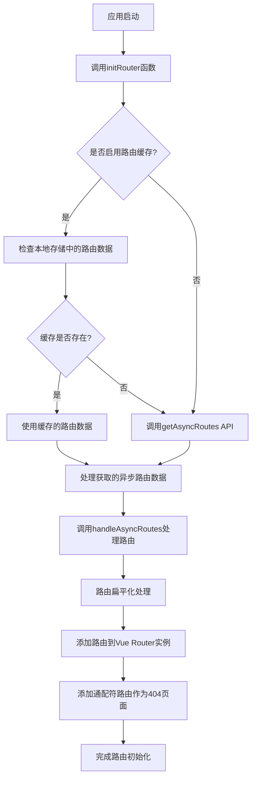
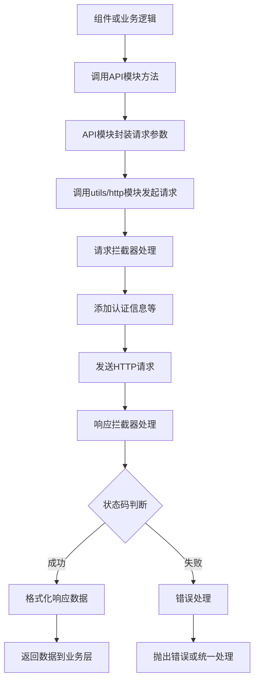

# Vue Pure Admin 架构文档

## 目录

- [项目概述](#项目概述)
- [整体架构](#整体架构)
- [路由系统](#路由系统)
  - [路由的初始化流程](#路由的初始化流程)
  - [动态路由处理机制](#动态路由处理机制)
  - [路由组件查找策略](#路由组件查找策略)
  - [路由冲突处理](#路由冲突处理)
- [API调用流程](#API调用流程)
- [权限管理](#权限管理)
- [状态管理](#状态管理)
- [关键组件](#关键组件)
- [常见问题及解决方案](#常见问题及解决方案)

## 项目概述

Vue Pure Admin 是一款基于 Vue 3、Vite、Element Plus、TypeScript、Pinia 等主流技术开发的中后台管理系统模板。项目采用 ECMAScript 模块（ESM）规范组织代码，具有开箱即用的特性。

本文档旨在帮助开发者快速理解项目的架构设计、代码组织方式和主要功能实现原理，特别关注路由系统和API调用流程。

## 整体架构

Vue Pure Admin 采用了现代前端应用的分层架构，主要分为以下几层：

1. **视图层(View)**: 由Vue组件构成，位于`/src/views`目录
2. **路由层(Router)**: 管理应用的导航和页面跳转，位于`/src/router`目录
3. **状态管理层(Store)**: 使用Pinia管理应用状态，位于`/src/store`目录
4. **API层**: 封装后端接口调用，位于`/src/api`目录
5. **工具层(Utils)**: 提供各种辅助工具函数，位于`/src/utils`目录
6. **布局层(Layout)**: 提供应用的整体布局框架，位于`/src/layout`目录

### 应用架构线框图

```
+----------------------------------------------------------------------+
|                         用户界面(浏览器)                                |
+----------------------------------------------------------------------+
                               |
                               v
+----------------------------------------------------------------------+
|                       主应用框架(App.vue)                              |
+----------------------------------------------------------------------+
                               |
                               v
+----------------------------------------------------------------------+
|                          布局系统(Layout)                              |
|  +----------------+  +----------------+  +------------------------+   |
|  |     侧边栏      |  |    顶部导航栏   |  |      多标签页管理       |   |
|  | (SideBar.vue)  |  | (NavBar.vue)  |  |   (TabsView.vue)      |   |
|  +----------------+  +----------------+  +------------------------+   |
|                               |                                       |
|                               v                                       |
|  +------------------------------------------------------------------+ |
|  |                      主内容区 (RouterView)                        | |
|  +------------------------------------------------------------------+ |
+----------------------------------------------------------------------+
                               |
                               v
+----------------------------------------------------------------------+
|                            路由系统                                    |
|  +------------------+  +------------------+  +--------------------+   |
|  |   路由配置         |  |   路由守卫        |  |   动态路由加载      |   |
|  | (router/modules)  |  | (permission.ts) |  | (utils.ts)         |   |
|  +------------------+  +------------------+  +--------------------+   |
+----------------------------------------------------------------------+
          |                     |                       |
          v                     v                       v
+----------------------------------------------------------------------+
|                           状态管理(Pinia)                              |
|  +----------------+  +----------------+  +----------------+  +------+ |
|  |  用户状态       |  |   权限状态      |  |  应用设置       |  | ... | |
|  | (user.ts)      |  | (permission.ts)|  | (app.ts)       |  |      | |
|  +----------------+  +----------------+  +----------------+  +------+ |
+----------------------------------------------------------------------+
                               |
                               v
+----------------------------------------------------------------------+
|                         API调用层(axios)                               |
|  +----------------+  +----------------+  +----------------+  +------+ |
|  |  用户API        |  |   路由API       |  |  业务模块API    |  | ... | |
|  | (user.ts)      |  | (routes.ts)    |  | (modules/*.ts) |  |      | |
|  +----------------+  +----------------+  +----------------+  +------+ |
+----------------------------------------------------------------------+
                               |
                               v
+----------------------------------------------------------------------+
|                           工具函数层                                   |
|  +----------------+  +----------------+  +----------------+  +------+ |
|  |  HTTP请求工具   |  |  缓存管理工具   |  |  格式化工具     |  | ... | |
|  | (http/index.ts)|  | (storage.ts)   |  | (format.ts)    |  |      | |
|  +----------------+  +----------------+  +----------------+  +------+ |
+----------------------------------------------------------------------+
                               |
                               v
+----------------------------------------------------------------------+
|                         后端API服务器                                  |
+----------------------------------------------------------------------+
```

项目目录结构概览：

```
vue-pure-admin-main/
├── build/               # 构建相关配置
├── docs/                # 项目文档
├── locales/             # 国际化资源
├── mock/                # 模拟数据
├── public/              # 静态资源
├── src/
│   ├── api/             # API接口封装
│   ├── assets/          # 项目资源文件
│   ├── components/      # 通用组件
│   ├── config/          # 配置文件
│   ├── layout/          # 布局组件
│   ├── plugins/         # 插件
│   ├── router/          # 路由配置
│   ├── store/           # 状态管理
│   ├── styles/          # 样式文件
│   ├── utils/           # 工具函数
│   └── views/           # 页面视图
├── types/               # TypeScript类型定义
├── package.json         # 依赖管理
├── vite.config.ts       # Vite配置
└── tsconfig.json        # TypeScript配置
```

## 路由系统

Vue Pure Admin 的路由系统是一个复杂而灵活的子系统，支持静态路由和动态路由的混合使用，并具有路由缓存、权限控制等高级特性。

### 路由的初始化流程

路由初始化的主要流程如下：



路由初始化的关键代码位于`src/router/utils.ts`中的`initRouter`函数：

```typescript
function initRouter() {
  if (getConfig()?.CachingAsyncRoutes) {
    // 开启动态路由缓存本地localStorage
    const key = "async-routes";
    
    // 清理缓存，强制重新获取路由配置
    console.log("[路由] 清理路由缓存，强制重新获取");
    storageLocal().removeItem(key);
    
    const asyncRouteList = storageLocal().getItem(key) as any;
    if (asyncRouteList && asyncRouteList?.length > 0) {
      return new Promise(resolve => {
        handleAsyncRoutes(asyncRouteList);
        resolve(router);
      });
    } else {
      return new Promise(resolve => {
        getAsyncRoutes().then(({ data }) => {
          handleAsyncRoutes(cloneDeep(data));
          storageLocal().setItem(key, data);
          resolve(router);
        });
      });
    }
  } else {
    return new Promise(resolve => {
      getAsyncRoutes().then(({ data }) => {
        handleAsyncRoutes(cloneDeep(data));
        resolve(router);
      });
    });
  }
}
```

### 动态路由处理机制

Vue Pure Admin 支持从后端动态获取路由配置，这使得应用可以根据用户角色动态生成菜单和权限。动态路由处理的核心是`handleAsyncRoutes`和`addAsyncRoutes`函数。

`handleAsyncRoutes`函数主要完成以下任务：
1. 处理从后端获取的路由数据
2. 检查和处理路由冲突
3. 将处理后的路由添加到Vue Router实例
4. 更新状态管理中的菜单数据

`addAsyncRoutes`函数主要完成以下任务：
1. 递归处理路由配置
2. 处理路由的组件解析
3. 处理路由的重定向配置
4. 根据命名约定查找匹配的视图组件

### 路由组件查找策略

Vue Pure Admin 使用了一个复杂的组件查找策略，尝试通过多种方式找到与路由匹配的组件：

1. **精确匹配**: 尝试直接匹配组件路径
2. **路径匹配**: 根据路由路径构建可能的组件路径
3. **命名约定匹配**: 根据路由名称构建可能的组件路径(如CheckCategory => check/category)
4. **后备策略**: 如果找不到匹配的组件，使用错误页面组件(404)作为替代

这种灵活的匹配策略确保了路由系统的健壮性，即使组件路径和路由配置不完全一致，也能正确找到对应的组件。

### 路由冲突处理

Vue Pure Admin 实现了路径冲突和名称冲突的检测与修复机制：

```typescript
// 递归检查路径和名称冲突
const checkPathConflicts = (routes, parentPath = "") => {
  routes.forEach(route => {
    const fullPath = parentPath ? `${parentPath}/${route.path.replace(/^\//, '')}` : route.path;
    
    // 检查路径冲突
    if (pathMap.has(fullPath)) {
      // 修正冲突路径，为路径添加随机后缀
      if (route.name && !fullPath.includes('error')) {
        const originalPath = route.path;
        route.path = `${originalPath}_${Date.now()}`;
      }
    } else {
      pathMap.set(fullPath, route.name || '未命名路由');
    }
    
    // 检查名称冲突
    if (route.name) {
      if (nameMap.has(route.name)) {
        // 修正冲突名称，为名称添加随机后缀
        const originalName = route.name;
        route.name = `${originalName}_${Date.now()}`;
      } else {
        nameMap.set(route.name, fullPath);
      }
    }
    
    // 递归处理子路由
    if (route.children && route.children.length) {
      checkPathConflicts(route.children, fullPath);
    }
  });
};
```

## API调用流程

Vue Pure Admin 对API调用进行了统一的封装，主要基于Axios实现。API调用的流程如下：



以获取异步路由为例，API调用代码如下：

```typescript
// src/api/routes.ts
export const getAsyncRoutes = () => {
  // 添加日志输出
  console.log("[路由] 尝试从后端获取异步路由");
  
  return new Promise<r>((resolve, reject) => {
    http.request<r>("get", "/get-async-routes")
      .then(res => {
        console.log("[路由] 成功获取异步路由", res);
        resolve(res);
      })
      .catch(error => {
        console.error("[路由] 获取异步路由失败", error);
        console.log("[路由] 使用本地路由数据");

        // 使用本地路由数据作为后备
        const localAsyncRoutes = {
          success: true,
          data: [
            // ... 本地路由配置
          ]
        };
        
        resolve(localAsyncRoutes);
      });
  });
};
```

HTTP工具模块提供了统一的请求处理机制，包括请求/响应拦截、错误处理、Token刷新等功能。

## 权限管理

Vue Pure Admin 实现了基于角色的权限控制系统(RBAC)，权限控制主要体现在以下几个方面：

1. **菜单权限**: 根据用户角色过滤显示菜单
2. **页面权限**: 通过路由守卫控制页面访问权限
3. **按钮权限**: 提供权限指令控制按钮的显示

权限控制的核心代码位于：
- `src/store/modules/permission.ts`: 权限状态管理
- `src/router/utils.ts`: 路由权限过滤
- `src/directives/permission/index.ts`: 权限指令

过滤无权限菜单的核心代码：

```typescript
function filterNoPermissionTree(data: RouteComponent[]) {
  const currentRoles = storageLocal().getItem<DataInfo<number>>(userKey)?.roles ?? [];
  const newTree = cloneDeep(data).filter((v: any) =>
    isOneOfArray(v.meta?.roles, currentRoles)
  );
  newTree.forEach(
    (v: any) => v.children && (v.children = filterNoPermissionTree(v.children))
  );
  return filterChildrenTree(newTree);
}
```

## 状态管理

Vue Pure Admin 使用Pinia作为状态管理库，主要模块包括：

1. **user**: 管理用户信息和登录状态
2. **permission**: 管理路由权限和菜单
3. **multiTags**: 管理多标签页
4. **app**: 管理应用级设置

Pinia模块的调用示例：

```typescript
// 调用用户模块的登出方法
function logout() {
  useUserStoreHook().logOut();
}

// 获取权限模块的菜单数据
const { wholeMenus } = storeToRefs(usePermissionStoreHook());
```

## 关键组件

Vue Pure Admin 包含多个核心组件，它们共同构成了系统的基础功能：

1. **Layout**: 布局组件，提供应用的整体框架结构
   - `src/layout/index.vue`: 主布局组件
   - `src/layout/components/`: 布局子组件(菜单、头部、标签页等)

2. **多标签页**: 支持多页面同时打开和切换
   - `src/layout/components/tag/index.vue`: 标签页组件
   - `src/store/modules/multiTags.ts`: 标签页状态管理

3. **动态主题**: 支持主题切换和自定义
   - `src/layout/components/theme/index.vue`: 主题设置组件
   - `src/store/modules/epTheme.ts`: 主题状态管理

4. **国际化**: 支持多语言切换
   - `src/plugins/i18n/index.ts`: 国际化插件
   - `locales/`: 语言资源文件

## 常见问题及解决方案

### 1. 路由匹配问题

**问题**: 路由报错"No match for"，无法找到匹配的路由。

**解决方案**:
- 检查路由路径格式，确保子路由使用相对路径而非绝对路径
- 确保本地mock路由数据与静态路由配置一致
- 使用路由处理的调试日志查看具体问题

**示例**:
```typescript
// 错误的子路由配置(使用绝对路径)
{
  path: "/check/category",
  name: "CheckCategory",
  component: () => import("@/views/check/category/index.vue")
}

// 正确的子路由配置(使用相对路径)
{
  path: "category",
  name: "CheckCategory",
  component: () => import("@/views/check/category/index.vue")
}
```

### 2. 组件加载问题

**问题**: 路由存在但组件无法加载。

**解决方案**:
- 检查组件路径是否正确
- 利用增强的组件查找策略，支持多种路径格式
- 针对特定路由添加专门的处理逻辑

**示例**:
```typescript
// 特殊处理CheckCategory路由
if (v.name === "CheckCategory") {
  console.log(`[路由调试] 处理CheckCategory组件路径: ${componentPath}, 路由路径: ${v.path}`);
  
  // 列出可能的所有匹配模式
  const possiblePaths = [
    "check/category/index", 
    "views/check/category/index",
    "check/category",
    "views/check/category"
  ];
  
  // 查找匹配的组件
  for (const path of possiblePaths) {
    const foundIndex = modulesRoutesKeys.findIndex(key => key.includes(path));
    if (foundIndex !== -1) {
      index = foundIndex;
      console.log(`[路由调试] 找到CheckCategory组件: ${modulesRoutesKeys[index]}`);
      break;
    }
  }
}
```

### 3. 退出登录问题

**问题**: 退出登录时可能出现DOM访问错误。

**解决方案**:
- 在logout方法中使用setTimeout延迟导航
- 确保在DOM更新后再进行路由跳转

**示例**:
```typescript
logOut() {
  this.username = "";
  this.roles = [];
  // ...其他清理操作
  removeToken();
  useMultiTagsStoreHook().handleTags("equal", [...routerArrays]);
  resetRouter();
  
  // 使用延迟确保DOM更新后再导航
  setTimeout(() => {
    router.push("/login");
  }, 10);
}
``` 