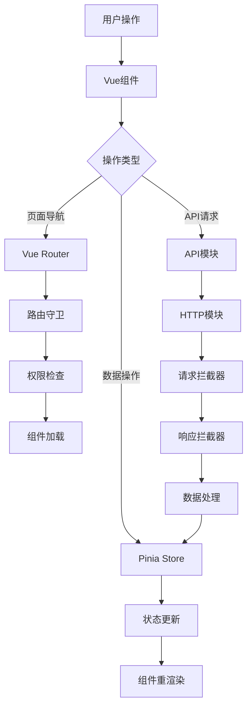

# Vue Pure Admin 代码库概览

## 文档导航

本文档提供Vue Pure Admin项目的整体概览，帮助开发者快速理解项目架构和关键组件。

详细文档：
- [架构详细文档](./architecture-guide.md) - 项目整体架构和实现细节
- [API调用流程图](./api-flow-diagram.md) - API调用流程和数据交互
- [路由系统详解](./router-system-guide.md) - 路由系统设计和实现

## 项目概述

Vue Pure Admin 是一款基于 Vue 3、Vite、Element Plus、TypeScript、Pinia 等主流技术开发的中后台管理系统模板。项目采用 ECMAScript 模块（ESM）规范组织代码，具有开箱即用的特性。

### 技术栈与依赖关系图

```
                      +--------------------+
                      |    Vue Pure Admin  |
                      +--------------------+
                              |
            +------------------+------------------+
            |                  |                  |
  +-----------------+  +-----------------+  +-----------------+
  |   核心框架      |  |    状态管理      |  |   UI组件库      |
  +-----------------+  +-----------------+  +-----------------+
  | - Vue 3         |  | - Pinia         |  | - Element Plus  |
  | - Vue Router 4  |  |                 |  | - Tailwind CSS  |
  | - TypeScript    |  |                 |  | - Icon组件      |
  +-----------------+  +-----------------+  +-----------------+
            |                  |                  |
  +-----------------+  +-----------------+  +-----------------+
  |   构建工具      |  |   HTTP客户端     |  |   工具库        |
  +-----------------+  +-----------------+  +-----------------+
  | - Vite          |  | - Axios         |  | - lodash-es     |
  | - ESBuild       |  | - Mock.js       |  | - dayjs         |
  | - PostCSS       |  |                 |  | - mitt          |
  +-----------------+  +-----------------+  +-----------------+
            |                  |                  |
  +-----------------+  +-----------------+  +-----------------+
  |   代码规范      |  |   开发工具      |  |   测试工具      |
  +-----------------+  +-----------------+  +-----------------+
  | - ESLint        |  | - TypeScript    |  | - Vitest        |
  | - Prettier      |  | - VS Code配置   |  | - Cypress       |
  | - Husky         |  | - DevTools      |  |                 |
  +-----------------+  +-----------------+  +-----------------+
```

主要技术栈：
- **前端框架**：Vue 3
- **构建工具**：Vite
- **UI组件库**：Element Plus
- **开发语言**：TypeScript
- **状态管理**：Pinia
- **路由管理**：Vue Router
- **HTTP客户端**：Axios
- **CSS框架**：Tailwind CSS

## 系统架构

Vue Pure Admin采用现代前端应用的分层架构：

```
+------------------------------------------+
|                 视图层                    |
| +----------------+ +------------------+  |
| |    组件库       | |     页面视图      |  |
| +----------------+ +------------------+  |
+------------------------------------------+
|                 业务层                    |
| +----------------+ +------------------+  |
| |   状态管理      | |     路由管理      |  |
| +----------------+ +------------------+  |
+------------------------------------------+
|                 数据层                    |
| +----------------+ +------------------+  |
| |   API封装      | |     数据模型      |  |
| +----------------+ +------------------+  |
+------------------------------------------+
|                 工具层                    |
| +----------------+ +------------------+  |
| |   工具函数      | |     插件封装      |  |
| +----------------+ +------------------+  |
+------------------------------------------+
```

## 核心功能模块

### 1. 路由系统

Vue Pure Admin的路由系统是一个复杂而灵活的子系统，支持静态路由和动态路由的混合使用。

**关键特性**：
- 支持前端静态路由和后端动态路由
- 基于角色的路由权限控制
- 智能的组件匹配策略
- 路由缓存机制
- 路由冲突检测与修复

**核心流程**：
```
应用启动 → 初始化路由 → 获取动态路由 → 处理路由数据 → 添加到路由实例 → 生成菜单
```

### 2. API调用系统

Vue Pure Admin对API调用进行了统一的封装，主要基于Axios实现。

**关键特性**：
- 统一的请求/响应拦截
- Token自动刷新机制
- 错误统一处理
- 请求重试机制
- 本地数据mock支持

**核心流程**：
```
组件调用API → 封装请求参数 → 请求拦截器 → 发送HTTP请求 → 响应拦截器 → 格式化响应 → 返回数据
```

### 3. 权限管理

Vue Pure Admin实现了基于角色的权限控制系统(RBAC)。

**关键特性**：
- 菜单级权限控制
- 页面级权限控制
- 按钮级权限控制
- 权限指令支持

**核心流程**：
```
用户登录 → 获取用户角色 → 获取权限菜单 → 过滤无权限路由 → 生成有权限的菜单
```

### 4. 多标签页

Vue Pure Admin实现了多标签页功能，支持多页面同时打开和切换。

**关键特性**：
- 标签页与路由联动
- 标签页持久化
- 标签页右键菜单
- 关闭、刷新、固定标签

**核心流程**：
```
路由跳转 → 生成标签页 → 标签页缓存 → 标签页操作 → 触发路由变化
```

### 5. 主题系统

Vue Pure Admin支持主题切换和自定义。

**关键特性**：
- 明暗主题切换
- 主题色自定义
- 主题配置持久化

**核心流程**：
```
用户选择主题 → 切换CSS变量 → 更新DOM样式 → 保存主题配置
```

## 目录结构说明

```
vue-pure-admin-main/
├── build/               # 构建相关配置
├── docs/                # 项目文档
├── locales/             # 国际化资源
├── mock/                # 模拟数据
├── public/              # 静态资源
├── src/
│   ├── api/             # API接口封装
│   ├── assets/          # 项目资源文件
│   ├── components/      # 通用组件
│   ├── config/          # 配置文件
│   ├── layout/          # 布局组件
│   ├── plugins/         # 插件
│   ├── router/          # 路由配置
│   ├── store/           # 状态管理
│   ├── styles/          # 样式文件
│   ├── utils/           # 工具函数
│   └── views/           # 页面视图
├── types/               # TypeScript类型定义
├── package.json         # 依赖管理
├── vite.config.ts       # Vite配置
└── tsconfig.json        # TypeScript配置
```

## 关键文件说明

| 文件路径 | 说明 |
|---------|------|
| `src/router/index.ts` | 路由主文件，创建和导出路由实例 |
| `src/router/utils.ts` | 路由工具函数，包含路由处理的核心逻辑 |
| `src/api/routes.ts` | 路由API，包含获取动态路由的接口 |
| `src/utils/http/index.ts` | HTTP请求封装，包含请求/响应拦截器 |
| `src/store/modules/user.ts` | 用户状态管理，包含登录/登出逻辑 |
| `src/store/modules/permission.ts` | 权限状态管理，包含路由权限控制 |
| `src/layout/index.vue` | 主布局组件，包含整体页面结构 |
| `src/layout/components/lay-content/index.vue` | 内容区域组件，包含路由视图 |

## 数据流转图



### 项目数据流图

```
+------------------------------------------------------------------+
|                           用户界面                                |
|                                                                  |
|    +---------------------+        +----------------------+       |
|    |      用户操作        | -----> |     触发事件/方法     |       |
|    +---------------------+        +----------------------+       |
|                |                             |                   |
|                v                             v                   |
|    +---------------------+        +----------------------+       |
|    |    Vue组件渲染       | <----- |    组件状态更新       |       |
|    +---------------------+        +----------------------+       |
+------------------------------------------------------------------+
                |                             ^
                |                             |
                v                             |
+------------------------------------------------------------------+
|                         业务逻辑层                               |
|                                                                  |
|    +---------------------+        +----------------------+       |
|    |   组件方法/Hook     | -----> |      Pinia Action    |       |
|    +---------------------+        +----------------------+       |
|                |                             |                   |
|                |                             |                   |
|                v                             |                   |
|    +---------------------+        +----------------------+       |
|    |    API模块调用      | -----> |    状态管理(Pinia)    |       |
|    +---------------------+        +----------------------+       |
+------------------------------------------------------------------+
                |                             ^
                |                             |
                v                             |
+------------------------------------------------------------------+
|                         数据交互层                               |
|                                                                  |
|    +---------------------+        +----------------------+       |
|    |   HTTP请求封装      | -----> |     响应数据处理      |       |
|    +---------------------+        +----------------------+       |
|                |                             |                   |
|                |                             |                   |
|                v                             |                   |
|    +---------------------+        +----------------------+       |
|    |   请求拦截器处理    | -----> |     响应拦截器处理    |       |
|    +---------------------+        +----------------------+       |
+------------------------------------------------------------------+
                |                             ^
                |                             |
                v                             |
+------------------------------------------------------------------+
|                         后端服务层                               |
|                                                                  |
|    +---------------------+        +----------------------+       |
|    |   后端API接口       | -----> |     响应数据返回      |       |
|    +---------------------+        +----------------------+       |
+------------------------------------------------------------------+
```

## 常见问题与解决方案

### 1. 路由相关问题

**问题**：路由报错"No match for"，无法找到匹配的路由。

**解决方案**：
- 检查路由路径格式，确保子路由使用相对路径
- 确保本地mock路由数据与静态路由配置一致
- 使用路由处理的调试日志查看具体问题

### 2. API调用问题

**问题**：API请求失败或返回数据格式错误。

**解决方案**：
- 检查API接口地址是否正确
- 检查请求参数是否正确
- 查看网络请求日志，分析请求/响应数据
- 确认Token是否过期，检查认证信息

### 3. 组件加载问题

**问题**：路由存在但组件无法加载。

**解决方案**：
- 检查组件路径是否正确
- 利用增强的组件查找策略，支持多种路径格式
- 针对特定路由添加专门的处理逻辑

### 4. 权限问题

**问题**：用户有权限访问但页面显示空白或跳转到403。

**解决方案**：
- 检查路由配置中的roles数组
- 确保用户角色信息正确加载
- 在开发环境临时禁用权限检查

## 项目开发指南

### 添加新路由

1. 在`src/router/modules/`目录下创建路由模块文件
2. 在本地mock数据`src/api/routes.ts`中添加对应的路由配置
3. 确保路由路径格式正确（父路由使用绝对路径，子路由使用相对路径）
4. 开发对应的视图组件

### 添加新API

1. 在`src/api/`目录下创建或修改API模块文件
2. 使用`http.request`方法封装API请求
3. 定义请求参数和响应类型
4. 在组件中导入并使用API

### 添加新组件

1. 在`src/components/`目录下创建组件文件
2. 使用Vue 3的Composition API开发组件
3. 在需要的地方导入并使用组件

### 添加新页面

1. 在`src/views/`目录下创建页面文件
2. 添加对应的路由配置
3. 实现页面逻辑和UI
4. 添加权限控制（如果需要）

## 参与贡献

Vue Pure Admin欢迎社区贡献，贡献流程如下：

1. Fork代码库
2. 创建特性分支: `git checkout -b feature/your-feature`
3. 提交修改: `git commit -am 'feat: add your feature'`
4. 推送分支: `git push origin feature/your-feature`
5. 提交Pull Request

请确保您的代码符合项目的代码规范，并通过所有的测试。 