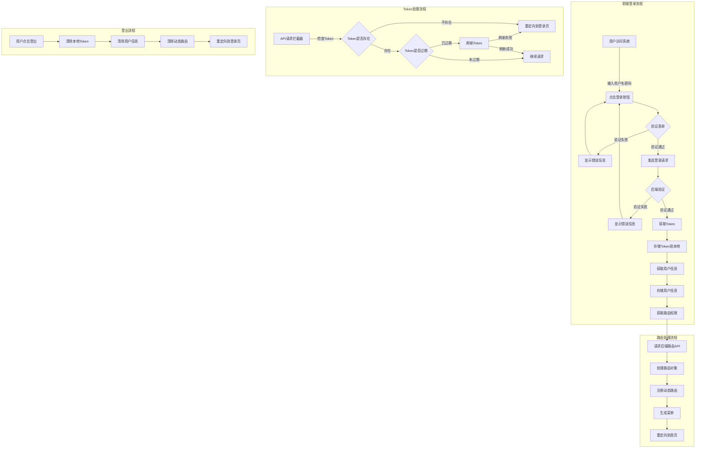

# 用户登录流程说明文档

## 登录流程图

## 详细流程说明

### 1. 前端登录流程

1. **用户访问系统**：
   - 用户打开浏览器，访问系统登录页面
   - 系统检查本地存储，如果已有有效Token，则自动跳转到首页
   - 如果没有Token或Token无效，则停留在登录页面

2. **输入登录信息**：
   - 用户输入用户名和密码
   - 可选：选择记住密码选项
   - 点击登录按钮

3. **前端表单验证**：
   - 验证用户名和密码是否符合格式要求
   - 如果验证失败，显示相应的错误信息
   - 如果验证通过，继续下一步

4. **发送登录请求**：
   - 前端将用户名和密码发送到后端API
   - API路径：`/api/v1/auth/login/`
   - 请求方法：POST

5. **处理登录响应**：
   - 如果登录失败，显示错误信息
   - 如果登录成功，获取返回的Token

6. **存储Token**：
   - 将Token存储到localStorage或Cookie中
   - 设置Token过期时间

7. **获取用户信息**：
   - 使用Token发送请求获取当前用户信息
   - API路径：`/api/v1/users/current/`
   - 请求方法：GET

8. **存储用户信息**：
   - 将用户信息存储到Pinia状态管理中
   - 包括用户基本信息、角色、权限等

### 2. 路由处理流程

1. **获取路由权限**：
   - 所有用户都通过API请求获取动态路由
   - API路径：`/api/v1/menus/routes/`
   - 请求方法：GET

2. **加载路由**：
   - 根据后端返回的权限数据动态加载路由
   - 后端根据用户角色和权限返回对应的路由配置

3. **处理路由对象**：
   - 处理路由组件的动态导入
   - 设置路由元信息(meta)
   - 处理路由重定向

4. **注册动态路由**：
   - 使用`router.addRoute`方法注册路由
   - 处理路由冲突和错误

5. **生成菜单**：
   - 根据注册的路由生成侧边栏菜单
   - 应用权限过滤，只显示有权限的菜单项

6. **重定向到首页**：
   - 登录成功后重定向到系统首页或仪表盘

### 3. Token处理流程

1. **API请求拦截**：
   - 使用Axios拦截器拦截所有API请求
   - 检查本地是否存在Token

2. **Token验证**：
   - 检查Token是否存在
   - 检查Token是否过期

3. **Token刷新**：
   - 如果Token即将过期，尝试刷新Token
   - API路径：`/api/v1/auth/refresh/`
   - 请求方法：POST

4. **请求处理**：
   - 如果Token有效，在请求头中添加Token继续请求
   - 如果Token无效且无法刷新，重定向到登录页面

### 4. 登出流程

1. **用户登出**：
   - 用户点击登出按钮
   - 发送登出请求到后端（可选）

2. **清除本地数据**：
   - 清除localStorage或Cookie中的Token
   - 清除Pinia中的用户信息
   - 重置路由配置

3. **重定向到登录页**：
   - 完成登出后重定向到登录页面

## 关键代码文件

1. **登录相关**：
   - `/src/views/login/index.vue` - 登录页面
   - `/src/api/auth.ts` - 认证相关API

2. **路由相关**：
   - `/src/router/index.ts` - 路由主配置
   - `/src/router/utils.ts` - 路由工具函数
   - `/src/api/routes.ts` - 路由获取API

3. **Token相关**：
   - `/src/utils/auth.ts` - Token处理工具
   - `/src/utils/http/index.ts` - Axios请求拦截器

4. **用户信息相关**：
   - `/src/store/modules/user.ts` - 用户信息状态管理
   - `/src/api/user.ts` - 用户相关API 