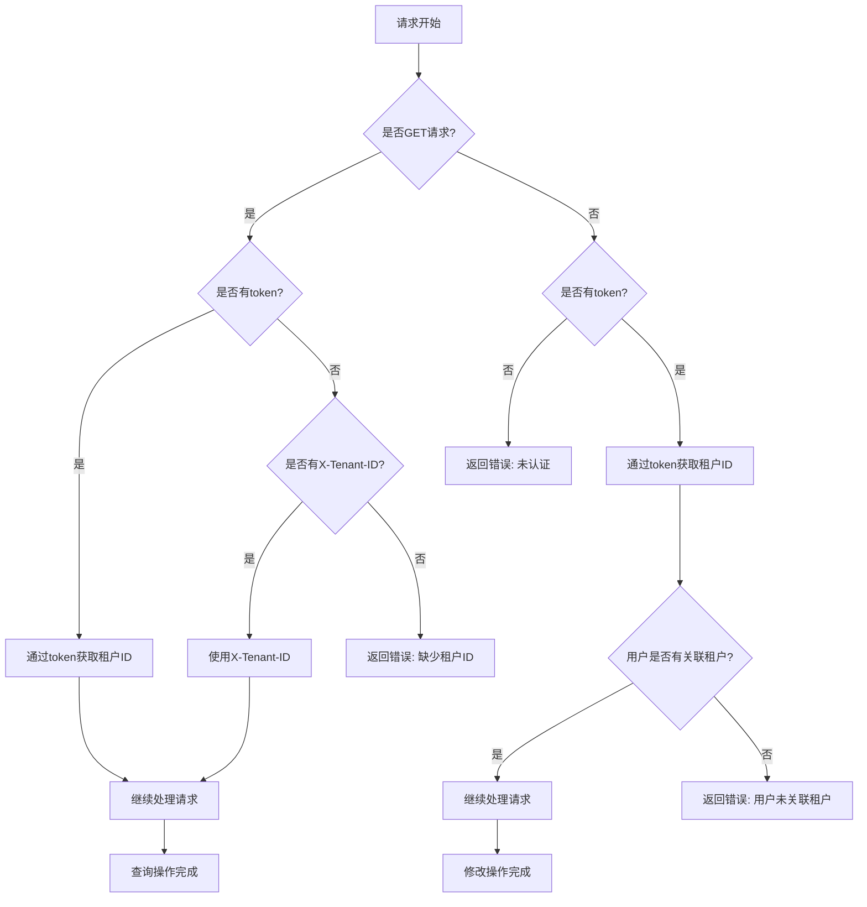
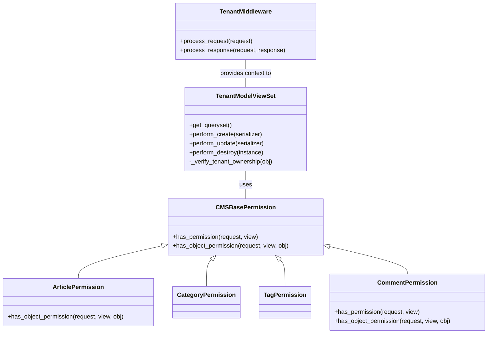
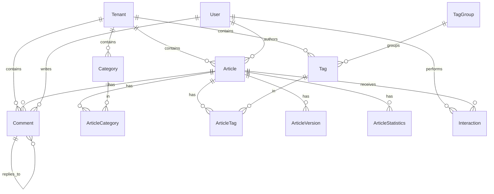

# CMS系统图表

## 1. 权限控制流程图

```mermaid
flowchart TD
    A[请求开始] --> B{是否GET请求?}
    B -->|是| C{是否有token?}
    B -->|否| D{是否有token?}
    
    C -->|是| E[通过token获取租户ID]
    C -->|否| F{是否有X-Tenant-ID?}
    
    F -->|是| G[使用X-Tenant-ID]
    F -->|否| H[返回错误: 缺少租户ID]
    
    E --> I[继续处理请求]
    G --> I
    
    D -->|是| J[通过token获取租户ID]
    D -->|否| K[返回错误: 未认证]
    
    J --> L{用户是否有关联租户?}
    L -->|是| M[继续处理请求]
    L -->|否| N[返回错误: 用户未关联租户]
    
    I --> O[查询操作完成]
    M --> P[修改操作完成]
```

## 2. 类图

```mermaid
classDiagram
    class CMSBasePermission {
        +has_permission(request, view)
        +has_object_permission(request, view, obj)
    }
    
    class ArticlePermission {
        +has_object_permission(request, view, obj)
    }
    
    class CategoryPermission {
    }
    
    class TagPermission {
    }
    
    class CommentPermission {
        +has_permission(request, view)
        +has_object_permission(request, view, obj)
    }
    
    class TenantModelViewSet {
        +get_queryset()
        +perform_create(serializer)
        +perform_update(serializer)
        +perform_destroy(instance)
        -_verify_tenant_ownership(obj)
    }
    
    class TenantMiddleware {
        +process_request(request)
        +process_response(request, response)
    }
    
    CMSBasePermission <|-- ArticlePermission
    CMSBasePermission <|-- CategoryPermission
    CMSBasePermission <|-- TagPermission
    CMSBasePermission <|-- CommentPermission
    
    TenantModelViewSet -- CMSBasePermission : uses
    TenantMiddleware -- TenantModelViewSet : provides context to
```

## 3. 实体关系图

```mermaid
erDiagram
    Tenant ||--o{ Article : contains
    Tenant ||--o{ Category : contains
    Tenant ||--o{ Tag : contains
    Tenant ||--o{ Comment : contains
    
    Article ||--o{ ArticleCategory : has
    Article ||--o{ ArticleTag : has
    Article ||--o{ Comment : has
    Article ||--o{ ArticleVersion : has
    Article ||--o{ ArticleStatistics : has
    
    Category ||--o{ ArticleCategory : in
    Tag ||--o{ ArticleTag : in
    TagGroup ||--o{ Tag : groups
    
    Comment ||--o{ Comment : replies_to
    
    User ||--o{ Article : authors
    User ||--o{ Comment : writes
    User ||--o{ Interaction : performs
    
    Article ||--o{ Interaction : receives
``` 